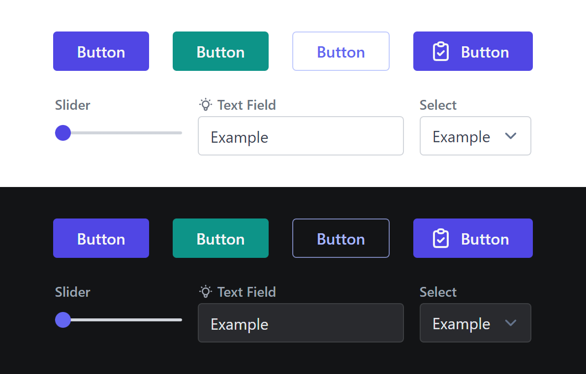

# 🤵 Dapper UI

Dapper UI is a UI library for Svelte. It is built on top of [TailwindCSS](https://tailwindcss.com/), but can also be used without it.

A small demo of the components is available at [https://bastian.github.io/dapper-ui/](https://bastian.github.io/dapper-ui/).

This is a project that is still under development and is very experimental. It is not recommended to use it in production or for serious projects.

## Install

tbd. Not published to NPM yet.

## Current State of Development

Components and structure are still experimental and can change at any time.
Hell, not even the name is final and can change.

Do not use this in production, but if you like it, feel free to star this repository to show your interest.

## Contributing

At this stage of development, I am not looking for contributions.

## License

This project is licensed under the [MIT License](/LICENSE).
