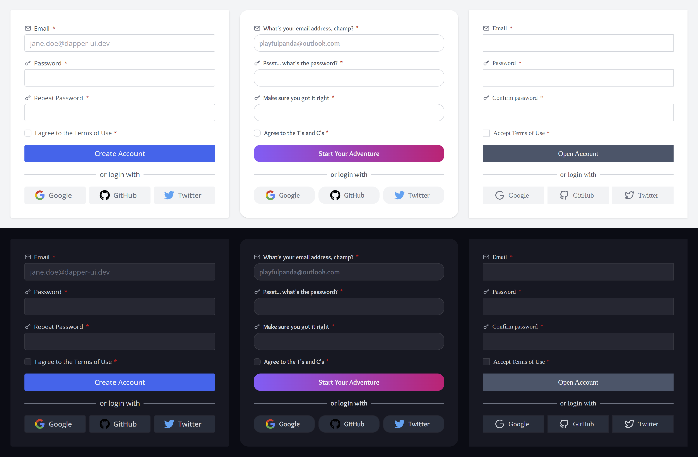

# Dapper UI 

Dapper UI is a sleek and modern UI component library for Svelte, offering full
TypeScript support and extensive documentation. With its built-in dark mode and
easy theming options, you can create a unique and personalized look for your
application. Built with [TailwindCSS](https://tailwindcss.com/), but compatible
with any styling solution, Dapper UI offers sleek, accessible and user-friendly
component for your next project.

- [Quick Start](https://dapper-ui.dev/docs/quick-start)
- [Browse Components](https://dapper-ui.dev/docs/button)

## Current State of Development

Please note that Dapper UI is still in the early stages of development and, as
such, it is not yet recommended for use in production environments. While the
majority of documented components are stable, there may be occasional breaking
changes or minor UI updates.

Despite this, you are welcome to try out Dapper UI on non-critical projects and
provide feedback. Your input is greatly appreciated as the functionality and
documentation are constantly being improved.

## Contributing

At this stage, I'm are not looking for code contributions. However, this will
change in the future.

## License

This project is licensed under the [MIT License](/LICENSE).
